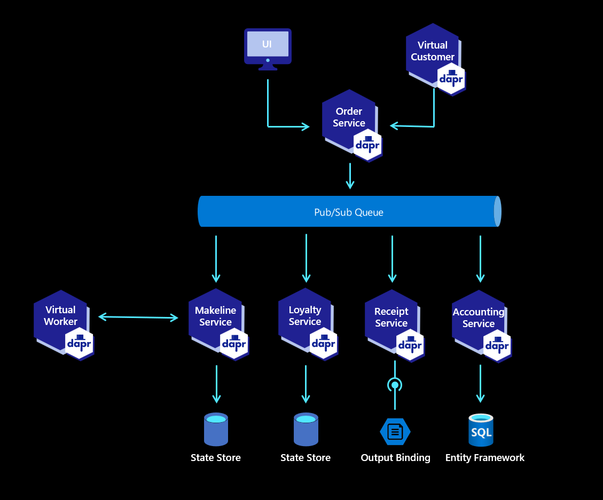

## Red Dog Demo - Azure Application Innovation Scenario

### Background

Microservices can be hard. But, while being exceedingly difficult to architect they have become an increasingly popular architecture pattern. As developers begin to migrate their existing monolithic code bases to a microservices system, they spend a lot of their time dealing with the inherent challenges presented by distributed applications, such as state management and service invocation.

Enter Dapr - The Distributed Application Runtime built with developers in mind. Dapr aims to solve some of these microservice-related challenges by providing consistent building blocks in the form of http/gRPC APIs that can be called natively or using one of the dapr language SDKs.

We have created this repository in order to provide a more comprehensive, code-first example of a microservices-based application that leverages the power of dapr. This codebase can be run on your local development machine or on a platform of your choosing. In an effort to help you best leverage the codebase, we have also created examples of how to deploy reddog-code to the Azure platform. The deployment options we have developed thus far are detailed in the section below. 

### Deployment Options

Below are some example scenarios for deploying the application. Each scenario is in its own repo.

* [Codespaces "Local" Development](docs/local-dev.md)
* [Hybrid / Arc Deployment](https://github.com/Azure/reddog-hybrid-arc)
* [Container Apps](https://github.com/Azure/reddog-containerapps)
* AKS (coming soon)

### Architecture Diagram

The reddog application is developed with .NET and Javascript. As mentioned above, it utilizes Dapr ([Distributed Application Runtime](https://dapr.io)) so it can easily be adapted to multiple scenarios. 

### Contributing

This project welcomes contributions and suggestions.  Most contributions require you to agree to a
Contributor License Agreement (CLA) declaring that you have the right to, and actually do, grant us
the rights to use your contribution. For details, visit https://cla.opensource.microsoft.com.

When you submit a pull request, a CLA bot will automatically determine whether you need to provide
a CLA and decorate the PR appropriately (e.g., status check, comment). Simply follow the instructions
provided by the bot. You will only need to do this once across all repos using our CLA.

This project has adopted the [Microsoft Open Source Code of Conduct](https://opensource.microsoft.com/codeofconduct/).
For more information see the [Code of Conduct FAQ](https://opensource.microsoft.com/codeofconduct/faq/) or
contact [opencode@microsoft.com](mailto:opencode@microsoft.com) with any additional questions or comments.
