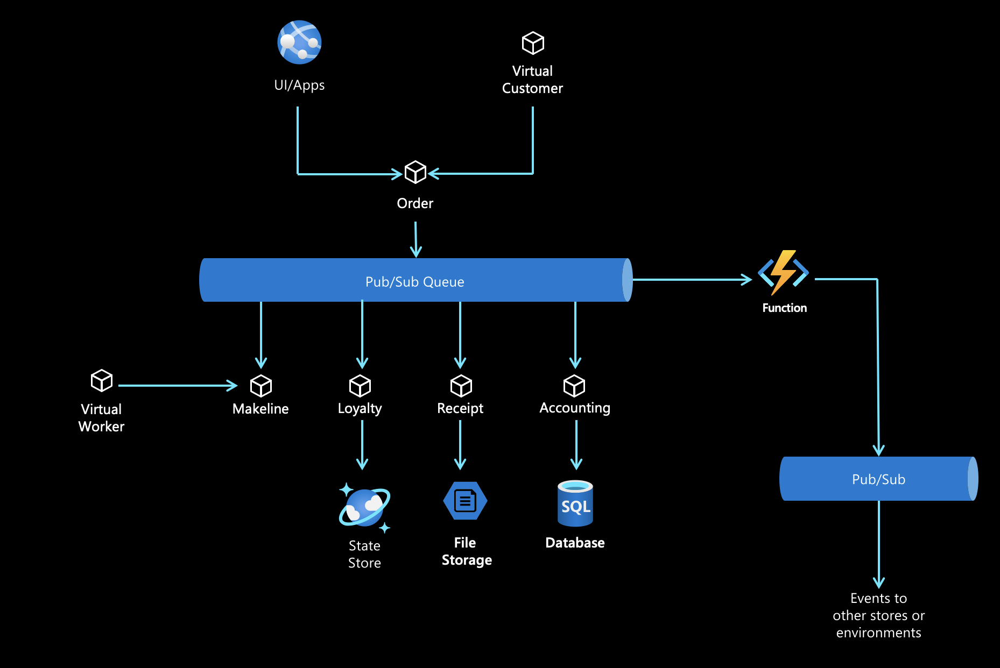

## Red Dog Demo - Azure Application Innovation Scenario

### Background

The purpose of this demo application is to show all of the great capabilities of the Azure Cloud for modern, cloud native applications. The app architecture includes common scenarios most organizations face such as Pub/Sub, integration, etc. 

The application can be deployed in many different ways including Local development, Hybrid Cloud (Arc), AKS, Container Apps, etc. It can also be easily adapted to new cool stuff in the future. 

The app is developed with .NET and Javascript and is based on a microservices architecture. It utilizes Dapr ([Distributed Application Runtime](https://dapr.io)) so it can easily be adapted to multiple scenarios. 

### Deployment Options

Below are some example scenarios for deploying the application. Each scenario is in its own repo.

* [Codespaces "Local" Development](docs/local-dev.md)
* [Hybrid / Arc Deployment](https://github.com/Azure/reddog-hybrid-arc)
* [Container Apps](https://github.com/Azure/reddog-containerapps)
* AKS (coming soon)

### Architecture Diagrams

Logical Application Architecture

### Contributing

This project welcomes contributions and suggestions.  Most contributions require you to agree to a
Contributor License Agreement (CLA) declaring that you have the right to, and actually do, grant us
the rights to use your contribution. For details, visit https://cla.opensource.microsoft.com.

When you submit a pull request, a CLA bot will automatically determine whether you need to provide
a CLA and decorate the PR appropriately (e.g., status check, comment). Simply follow the instructions
provided by the bot. You will only need to do this once across all repos using our CLA.

This project has adopted the [Microsoft Open Source Code of Conduct](https://opensource.microsoft.com/codeofconduct/).
For more information see the [Code of Conduct FAQ](https://opensource.microsoft.com/codeofconduct/faq/) or
contact [opencode@microsoft.com](mailto:opencode@microsoft.com) with any additional questions or comments.
